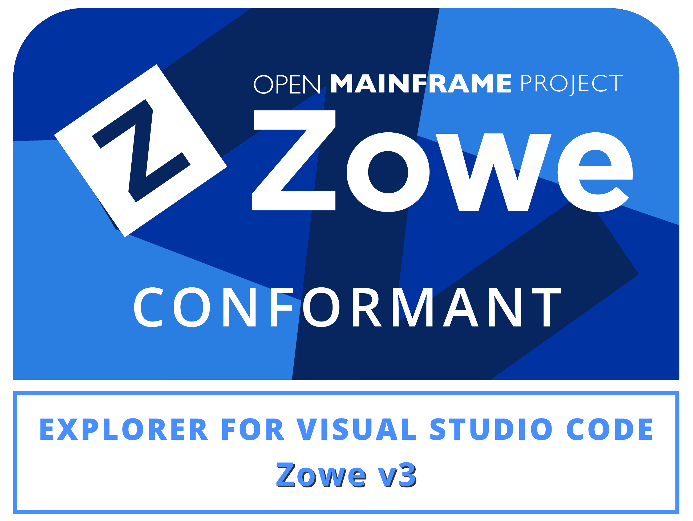
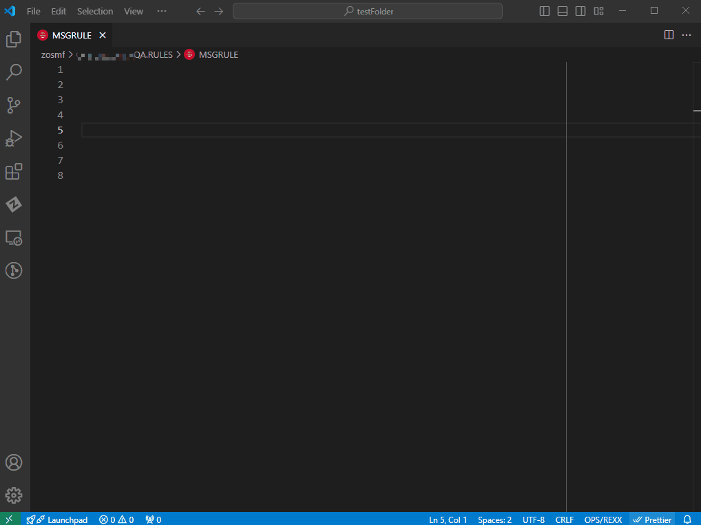
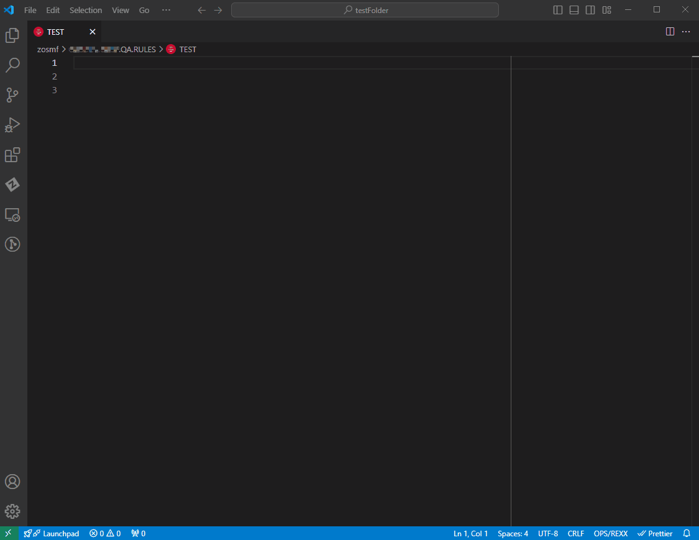
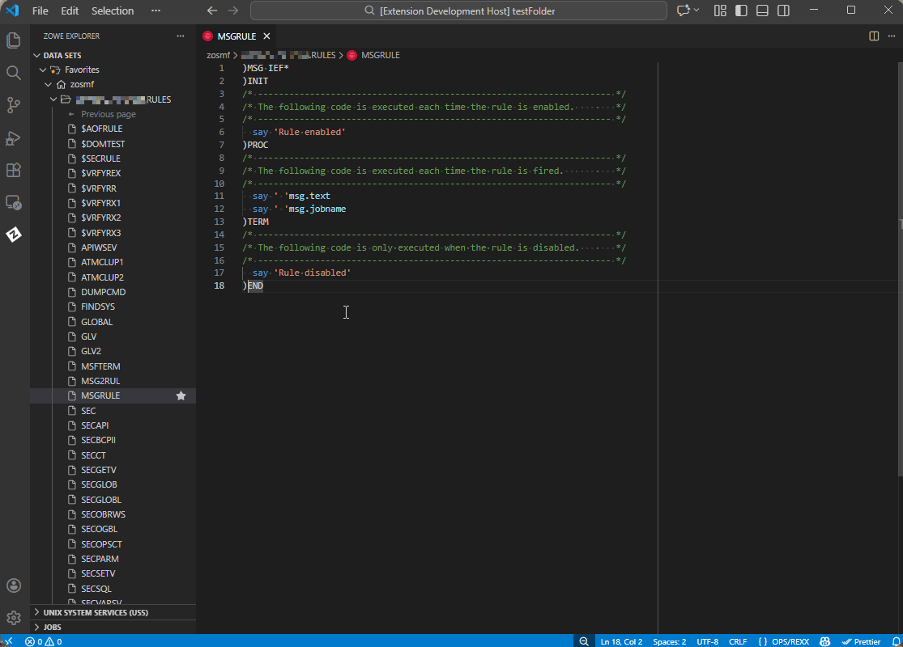
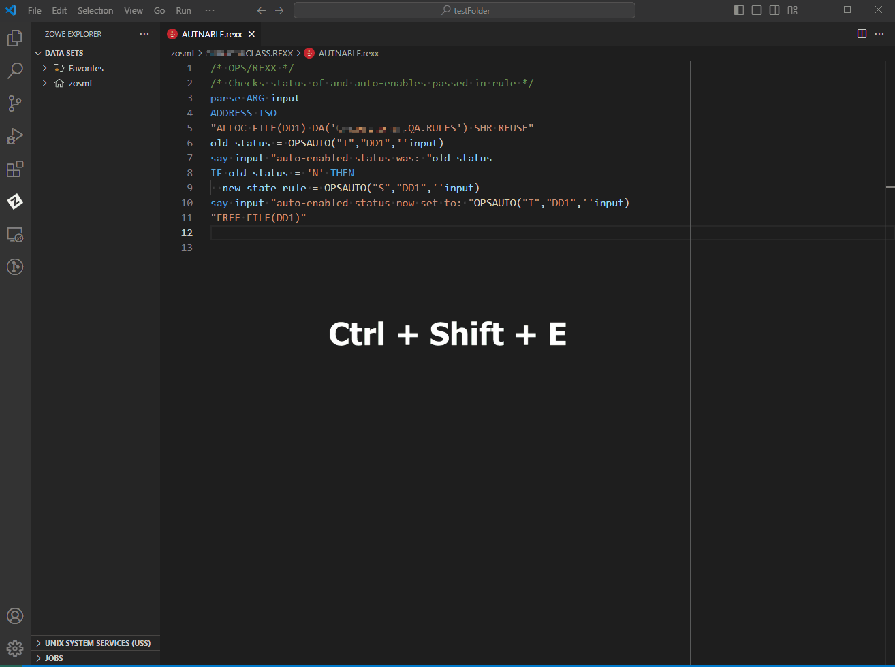
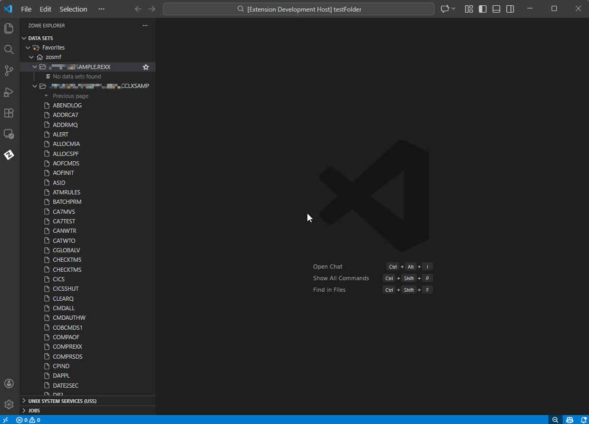

# OPS/REXX Language Support 

The OPS/REXX language is a crucial part of the Broadcom OPS/MVS® product that adds to standard REXX a set of extensions to automate and enhance the productivity of z/OS operations. With the OPS/REXX Language Support extension (OPS/REXX LS), automation engineers can develop OPS/MVS Automated Operations Facility (AOF) rules and OPS/REXX programs more efficiently by editing OPS/REXX in a local VS Code environment.

OPS/REXX LS includes the following features:

- OPS/REXX syntax highlighting
- Hover insights for OPS/REXX built-in functions, host environment names, and AOF event variable names
- Autocompletion for OPS/REXX built-in functions, host environment names, and AOF event variables
- Basic error checking for AOF rules and OPS/REXX syntax
- A library of frequently used OPS/REXX rule snippets
- If configured, specific OPS/MVS commands can be run to perform common rule actions and execute OPS/REXX programs

We encourage you to share ideas to help improve OPS/REXX Language Support. You can also report issues in the extension, using the following link.

> [Share an idea or open an issue in our Git repository](https://github.com/BroadcomMFD/opsrexx-language-support/issues)

## Address Software Requirements
OPS/REXX LS requires no prerequisite software.

Use the following recommended software with OPS/REXX LS for the best experience:
- REXX Language Support Extension
- OPS/MVS REST API
- Zowe Explorer

Using a REXX language support extension provides a full range of REXX syntax highlighting, not just highlighting for OPS/REXX syntax. Using the OPS/MVS REST API and a Zowe Explorer profile that contains connection information allows you to issue OPS/MVS commands and invoke OPS/REXX programs from within VS Code.

### REXX Language Support Extension

For correct display of full REXX syntax highlighting, use a REXX language support extension. OPS/REXX LS has been tested for compatibility with the [REXX Language Support extension](https://marketplace.visualstudio.com/items?itemName=broadcomMFD.lsp-for-rexx).

---

### OPS/MVS REST API

Establish a connection with your mainframe OPS/MVS instance using the OPS/MVS REST API as described in the [OPS/MVS documentation](https://techdocs.broadcom.com/us/en/ca-mainframe-software/automation/ca-ops-mvs-event-management-and-automation/14-0/using/use-the-rest-api.html). A connection to one or more OPS/MVS instances allows you to work with the AOF rules in your mainframe environment and to issue OPS/MVS commands from VS Code.

**Configure OPS/REXX LS for Access to OPS/MVS**

1. Ensure that OPS/MVS is configured with the OPS/MVS REST API (OPSREST) component.
   
   If you are using OPS/REXX LS with multiple OPS/MVS instances running on different subsystems, the OPS/MVS REST API must be installed and configured on each subsystem in your OPSplex. One instance of the REST API is required for each subsystem. When you have multiple instances of OPS/MVS running on a single subsystem, only one instance of the REST API is required.

2. In OPS/REXX LS settings, set the `Subsystem` parameter to the default subsystem for the OPS/MVS instance that you are using. You can also set default values for your program command parameters.

3. Create a team configuration file that contains the connection information for the OPS/MVS instance. Use _one_ of the following methods:

   - [Use Zowe Explorer](https://docs.zowe.org/stable/user-guide/ze-profiles) to create a team configuration file using the following information:
     - The host name of the LPAR on which the REST API is running.
     - The port number for the REST API.
     - A username that has authority to access the REST API.
     - The password to the account that is associated with the username.
    - [Manually create a team configuration file](https://techdocs.broadcom.com/us/en/ca-mainframe-software/automation/ca-ops-mvs-event-management-and-automation/14-0/installing/complete-configuration-tasks/integrate-with-zowe-cli.html#_3e6293fe-6d17-4652-afec-833084986884_section_3) using the same required information, as described in the OPS/MVS documentation.

<!-- Needs a verification step -->

---

### Zowe Explorer

Use Zowe Explorer to access mainframe code while using OPS/REXX LS. For more information about the Zowe Explorer extension, see [Zowe Explorer](https://marketplace.visualstudio.com/items?itemName=Zowe.vscode-extension-for-zowe) on the VS Code marketplace.

OPS/REXX LS is Zowe Explorer V3 Conformant. The Zowe Conformance Program ensures a high level of common functionality, interoperability, and user experience while using an extension that leverages Zowe. For more information, see [Zowe Conformance Program](https://www.openmainframeproject.org/all-projects/zowe/conformance).

**Configure OPS/REXX LS for Use with Zowe Explorer**
<!-- Actual procedure is a good Walkthrough candidate. Actually describing steps to associate a data set and its members as opsrexx files -->

To ensure that data sets not containing those first lines and accessed through Zowe Explorer are recognized by the extension as **.opsrexx** files, you must create a file association in your VS Code settings to associate data sets that contain OPS/REXX rules with the `.opsrexx` file extension.

To create a file association for a data set:

1. From the **File** menu, select **Preferences > Settings** to display the Settings editor.

2. Select the `User` or `Workspace` tab, depending on which settings you want to update.

3. Scroll down to or search for the **Files: Associations** setting and select **Add Item**.

4. Add `**/*QUALIFIER*{,/*}` to the **Key** field, and `opsrexx` to the **Value** field where `QUALIFIER` is the portion of the fully qualified data set path you want to be automatically set as an OPS/REXX file type.

    - For example, if you have a fully qualified data set called `OPSS.CCLXSAMP.SAMPLE.RULES`, you could put `**/*RULES*{,/*}` or `**/*CCLXSAMP*{,/*}` in the **key** field to automatically associate all files in any data set with the matching qualifier.

After completing these steps, you can use Zowe Explorer to access OPS/REXX files in data set members and use the full features of OPS/REXX LS.

<!-- Needs a verification step -->

---

## Use OPS/REXX LS

OPS/REXX programs and rules are automatically recognized when opened in VS Code in the following cases:
- When the file extension is `.opsrexx`
- When the first line of the file contains either the comment `/* OPSREXX */` or a rule type identifier, such as `)CMD` or `)MSG` (case-insensitive)
- When data set members that contain OPS/REXX programs and rules are opened using Zowe Explorer and the containing data set is associated with `opsrexx` files

When OPS/REXX programs and rules are recognized, syntax highlighting and basic error checking on AOF rules and OPS/REXX program syntax is enabled by default. Additional features of OPS/REXX LS are available depending on context and your configuration.

### OPS/REXX Hover Insights

Place and hold your cursor over an OPS/REXX element to view more information about it. Hover insights are available for OPS/REXX built-in functions, host environments, or AOF event variable names.

---

### Autocompletion

Autocompletion works for the following OPS/REXX language elements:
- AOF Variables
- Built-in Functions
- Host Environment Names

To trigger autocompletion of AOF variables, enter `.` after an AOF rule type stem, for example: `msg.` AOF variable completions are supported for all rule types.

Built-in function autocompletion is triggered automatically when you type an OPS/REXX built-in function or host environment name.

---

### OPS/REXX Snippets

Before you write AOF rules from scratch, check the snippet library for any applicable rule snippets. Using snippets promotes consistent and correct syntax in the rules you design. 

To use the snippet library:

1. Press `Ctrl/Cmd+Shift+P` to open the VS Code Command Palette.
2. Type `Insert Snippet`.
3. Select the command or press **Enter**.
4. Choose the type of rule snippet you want to insert.
5. Fill in the templated values to complete the OPS/REXX rule.

If you know the name of the snippet you want to use, you can begin typing the name of the snippet in the editor and select from the list of suggestions.

---

### OPS/MVS Commands

Issuing OPS/MVS commands from OPS/REXX LS requires an OPS/MVS REST API connection as described in "OPS/MVS REST API".

You can use OPS/REXX LS to issue the following OPS/MVS commands:

  - `Show Rule Status` - Shows the status of a selected rule.   
  - `Enable Rule` - Enables a selected rule.
  - `Disable Rule` - Disables a selected rule.
  - `Execute Program` - Executes a selected OPS/REXX program using your default OPS/MVS subsystem.
  - `Execute Program with Parameters` - Executes an OPS/REXX program that you choose by typing parameters into an input form.

With a data set that contains OPS/REXX rules open in the Zowe Explorer sidebar, to issue OPS/MVS commands:
  1. Right-click the data set member that contains the OPS/REXX rule or program in the Zowe Explorer sidebar. 
  2. Select the command from the OPS/REXX menu.

You can also issue commands for an open OPS/REXX rule or program by using the VS Code Command Pallet (`Ctrl+Shift+P`).

> **Tip**  
> You can use the **OPS/MVS: Execute Program with Parameters** command from the VS Code Command Palette regardless of which file is currently open and can be accessed using the keyboard shortcut `Ctrl+Shift+E`.

After a command is issued, the VS Code window displays a status message. If a command fails, a detailed error message displays.

**Issue Commands Using the Right-Click Menu**

The right-click menu provides quick access to OPS/MVS commands from the Zowe Explorer sidebar.

**Issue the Execute Program with Parameters Command**

Use the Command Pallet to execute OPS/MVS programs that require parameter input.

---

### OPS/MVS Automation Samples

OPS/MVS distributes sample AOF rules, OPS/REXX programs, and user exits that demonstrate various aspects of automating operations in a mainframe environment. You can use Zowe Explorer to copy these samples to your own library, and use the OPS/MVS Language Extension to develop, manage, and run your versions of these samples.

For a complete listing of the automation samples that are included with OPS/MVS, see [Sample Automation](https://techdocs.broadcom.com/us/en/ca-mainframe-software/automation/ca-ops-mvs-event-management-and-automation/14-0/reference-information/sample-automation.html) in the OPS/MVS documentation.

---

### Privacy Notice 
The extensions for Visual Studio Code developed by Broadcom Inc., including its corporate affiliates and subsidiaries, ("Broadcom") are provided free of charge, but in order to better understand and meet its users’ needs, Broadcom may collect, use, analyze and retain anonymous users’ metadata and interaction data, (collectively, “Usage Data”) and aggregate such Usage Data with similar Usage Data of other Broadcom customers. Please find more detailed information in License and Service Terms & Repository.

---

### Technical Assistance and Support
OPS/REXX Language Support is made available to customers on the Visual Studio Code Marketplace in accordance with the terms and conditions contained in the provided End-User License Agreement (EULA).

If you are on active support for OPS/MVS, you get technical assistance and support in accordance with the terms, guidelines, details, and parameters that are located within the Broadcom Working with Support guide.

This support generally includes:

Telephone and online access to technical support
Ability to submit new incidents 24x7x365
24x7x365 continuous support for Severity 1 incidents
24x7x365 access to Broadcom Support
Interactive remote diagnostic support
Technical support cases must be submitted to Broadcom in accordance with guidance provided in “Working with Support”.

> **Note**  
> To receive technical assistance and support, you must remain compliant with “Working with Support”, be current on all applicable licensing and maintenance requirements, and maintain an environment in which all computer hardware, operating systems, and third party software associated with the affected Broadcom software are on the releases and version levels from the manufacturer that Broadcom designates as compatible with the software. Changes you elect to make to your operating environment could detrimentally affect the performance of Broadcom software and Broadcom shall not be responsible for these effects or any resulting degradation in performance of the Broadcom software. Severity 1 cases must be opened via telephone and elevations of lower severity incidents to Severity 1 status must be requested via telephone.

------------------------------------------------------------------------------------------------
Copyright © 2025 Broadcom. The term "Broadcom" refers to Broadcom Inc. and/or its subsidiaries.

