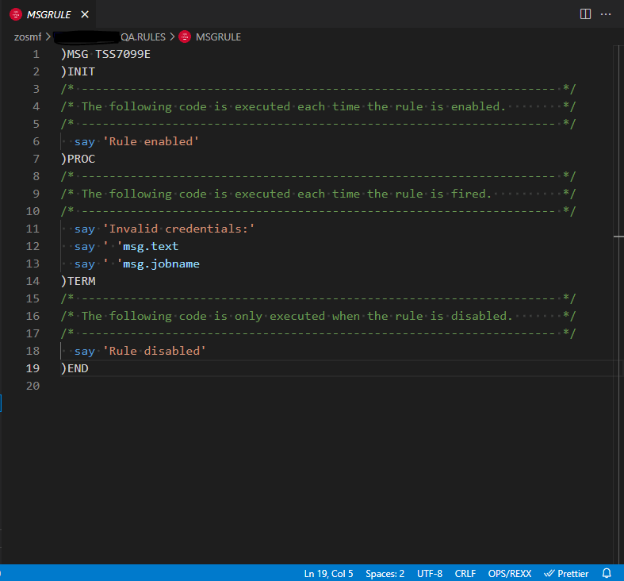
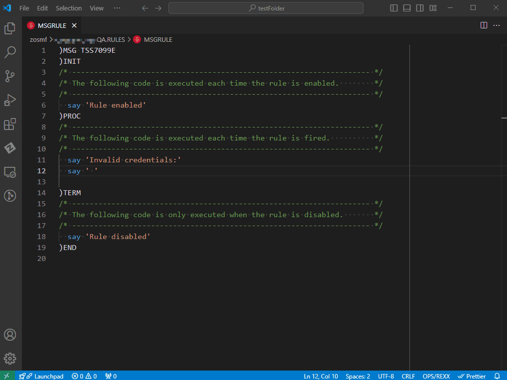
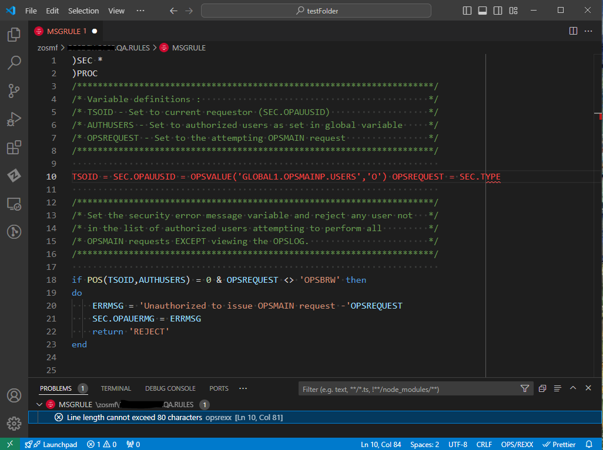
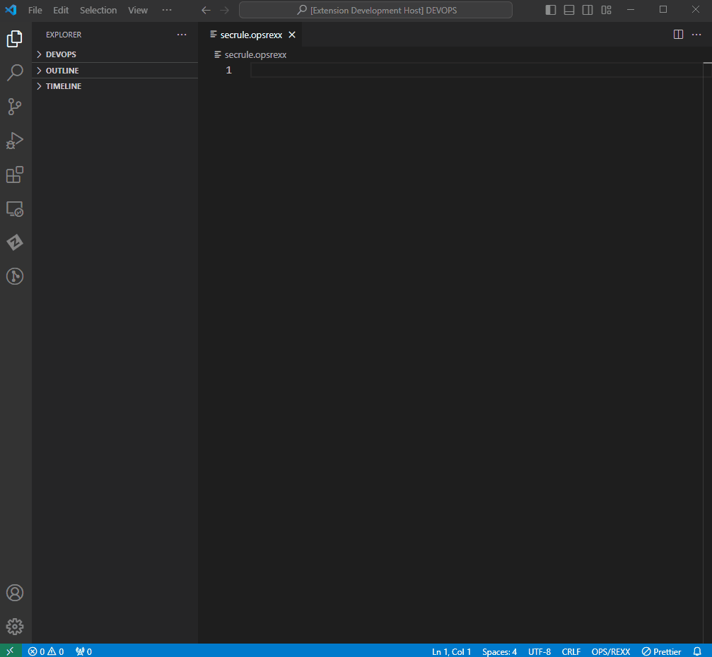
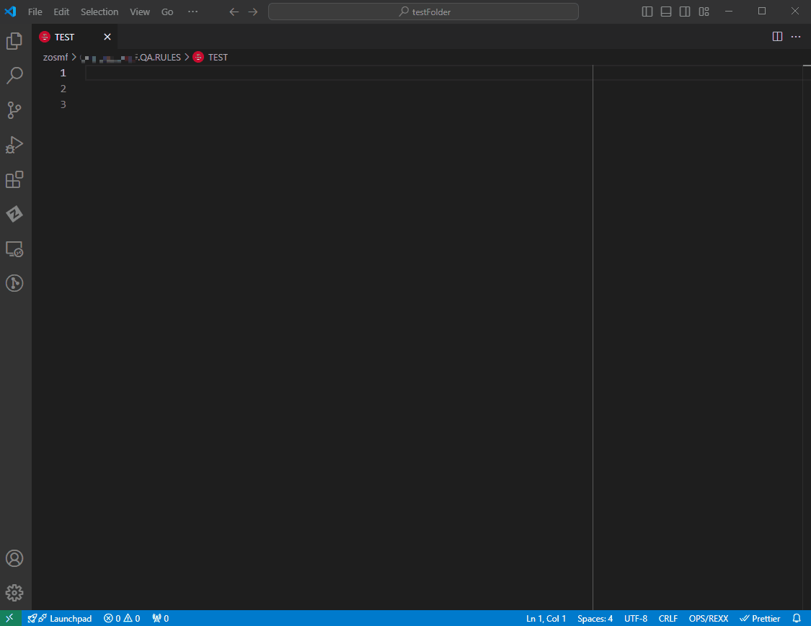
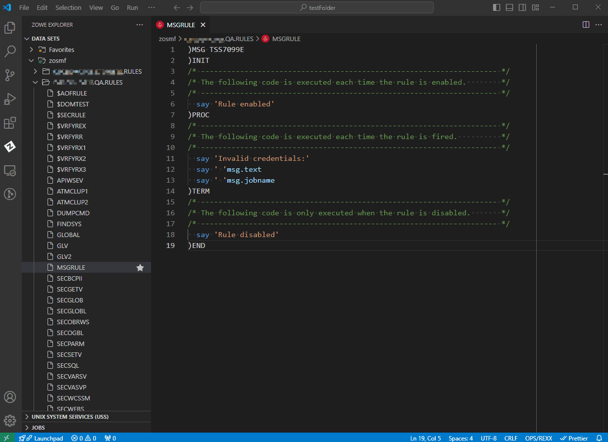

# OPS/REXX Language Support 

[](https://github.com/BroadcomMFD/opsrexx-language-support/issues)
[](/LICENSE)

The OPS/REXX language is a crucial part of the Broadcom OPS/MVS® product that adds to standard REXX a set of extensions to automate and enhance the productivity of z/OS operations. With the OPS/REXX Language Support extension, automation engineers can develop OPS/MVS Automated Operations Facility (AOF) rules and OPS/REXX programs more efficiently by editing OPS/REXX in a local VS Code environment.


## Key Features
OPS/REXX Language Support makes AOF rule and OPS/REXX program development easier by enabling you to

- Use OPS/REXX syntax highlighting to help distinguish the elements of AOF rules and OPS/REXX programs
- Use autocompletion for names of OPS/REXX built-in functions, host environments, and AOF event variables
- Get hover help on OPS/REXX built-in functions, host environment names, and AOF event variable names
- Get basic error checking for AOF rule and OPS/REXX syntax
- Copy from a library of frequently used OPS/REXX rule snippets
- Issue selected OPS/MVS commands


The OPS/REXX Language Support extension does _not_ provide the ability for you to download from, upload to, or submit jobs on the mainframe. To access mainframe code while using OPS/REXX Language Support, we recommend Zowe Explorer (see [Recommended Software](#recommended-software)) or Zowe CLI.

## Recommended Software
The OPS/REXX Language Support extension has no prerequisite software. However, for your best experience with OPS/REXX Language Support, we recommend the following software.

### REXX Language Support Extension
For correct display of syntax highlighting, we recommend using OPS/REXX Language Support with a REXX language support extension. OPS/REXX Language Support has been tested for compatibility with the [Broadcom REXX Language Support extension](https://marketplace.visualstudio.com/items?itemName=broadcomMFD.lsp-for-rexx).

### Zowe Explorer
We recommend using Zowe Explorer to access mainframe code while using OPS/REXX Language Support. For more information about the Zowe Explorer extension, see [Zowe Explorer](https://marketplace.visualstudio.com/items?itemName=Zowe.vscode-extension-for-zowe) on the VS Code marketplace.


## Using OPS/REXX Language Support with OPS/MVS
Although it is possible to use OPS/REXX Language Support without access to OPS/MVS, most users will want to use the extension while interacting with an OPS/MVS instance. To use OPS/REXX Language Support with OPS/MVS:

1. Ensure that your instance of OPS/MVS is configured with _one_ of the following components:

   - The REST API (OPSREST) 
   - RESTful Web Services (OPSWS)

2. In the OPS/REXX Language Support extension settings, specify the following parameters:
   
    **REST API**
     - If you are using the extension with the OPS/MVS REST API, activate the check box to set the value of this parameter to `true`.
     - If you are using the extension with OPS/MVS RESTful Web Services, deactivate the check box to set the value of this parameter to `false`.
   
    **Rule Set**
  
     Specify the default working rule set for the OPS/MVS instance you are using.
      
    **Subsystem**
   
     Specify the default subsystem for the OPS/MVS instance you are using.

3. Create a team configuration file containing the connection information for the OPS/MVS instance you would like to connect to. Use _one_ of the following methods:

   - [Use Zowe Explorer](https://docs.zowe.org/stable/user-guide/ze-profiles) to create a team configuration file.  Provide the following information:
   
     - The host name of the LPAR on which the REST API or RESTful Web Services is running.
     - The port number for the REST API or RESTful Web Services.
     - A username that has authority to access the REST API or RESTful Web Services.
     - The password to the account that is associated with the username.
    
   - Follow [these steps](https://techdocs.broadcom.com/us/en/ca-mainframe-software/devops/enterprise-support-for-zowe/1-0/using/zowe-cli/available-cli-plug-ins/ca-ops-mvs-plug-in-for-zowe-cli.html) to manually create a team configuration file.
    
4. When working with OPS/REXX files, ensure their file extension is `.opsrexx` to automatically enable OPS/REXX Language Support Extension features. For more information, see [Configuring for Zowe Explorer](#configuring-for-zowe-explorer-recommended).

### Using OPS/REXX Language Support with multiple OPS/MVS instances
- If you are using the extension with multiple OPS/MVS instances running on different systems, install and configure OPS/MVS RESTful Web Services or the OPS/MVS REST API on each system in your OPSplex. One instance of RESTful Web Services or the REST API is required for each system.
- When you have multiple instances of OPS/MVS running on a single system, only one instance of RESTful Web Services or the REST API is required.
   
## Configuring for Zowe Explorer (Recommended)
To ensure that data sets accessed through Zowe Explorer are recognized by the extension as **.opsrexx** files, you must create a file association in your VS Code settings.

To create a file association, use one of the following options.

**Option 1: Create a file association in Workspace Settings**     
1. Use the command palette in VS Code (**Ctrl/Cmd + Shift + P**) to locate the Workspace Settings.
2. Scroll down to the **Files: Associations** setting and click **Add Item**.
3. Add `*.REXX(*` to the **Key** field, and `opsrexx` to the **Value** field.
4. Add `*.RULES(*` to the **Key** field, and `opsrexx` to the **Value** field.

**Option 2: Create a file association in User Settings**
1. Use the command palette in VS Code (**Ctrl/Cmd + Shift + P**) to locate the file `settings.json` (User Settings).
2. In `settings.json`, add the lines `"*.REXX(*": "opsrexx"` and `"*.RULES(*": "opsrexx"` under `"files.associations"` as shown in the following example:
  
      ```
          "files.associations": {
              "*.REXX(*": "opsrexx",
              "*.RULES(*": "opsrexx",
          },
      ``` 

After completing the steps for either of the two options, you can use Zowe Explorer to access `.opsrexx` files.

## Using OPS/REXX Language Support

### OPS/REXX Syntax Highlighting
Use OPS/REXX syntax highlighting and symbol resolution to help you avoid syntax errors when developing rules.



### OPS/REXX Hover Insights
Place and hold your cursor over an OPS/REXX element to view more information about it. Hover insights are available for OPS/REXX built-in functions, host environments, or AOF event variable names.


### Variable Autocompletion
To trigger autocompletion of AOF variables, type `.` after an AOF rule type stem, such as `msg.`.
AOF variable completions are supported for all rule types.



Variable autocompletion is triggered automatically when you type an OPS/REXX built-in function or host environment name.


### Syntax Error Checking
OPS/REXX Language Support automatically performs some basic error checks on AOF rule and OPS/REXX program syntax, such as the line length warning shown in the following image.



### Using OPS/REXX Snippets
Before you write AOF rules from scratch, check the snippet library for any applicable rule snippets.
To use the snippet library:

1. Open the VS Code command palette by pressing `Ctrl/Cmd + Shift + P`.
2. Type `Insert Snippet`.
3. Click the command or press Enter.
4. Choose the type of rule snippet you want to insert.
5. Fill in the templated values to complete the OPS/REXX rule.




For a quicker way to access the snippets:

1. Begin typing the name of a snippet (such as `)MSG`) in the editor.
 
   VS Code autocomplete suggests the full name of the snippet.
 
2. Select the suggested snippet and press Enter.



Using snippets promotes consistent and correct syntax in the rules you design.

### Issuing OPS/MVS Commands
To issue OPS/MVS commands through OPS/REXX Language Support, you need an OPS/MVS RESTful Web Services or REST API connection. Configure the OPS/REXX Language Support extension for the connection as described in [Using OPS/REXX Language Support with OPS/MVS](#using-opsrexx-language-support-with-opsmvs).
 
If you are using Zowe Explorer (optional) to issue commands, configure the extension as described in [Configuring for Zowe Explorer](#configuring-for-zowe-explorer-recommended).

You can use OPS/REXX Language Support to issue the following OPS/MVS commands:

  - `Show Rule Status` - Shows the status of a selected rule.   
  - `Enable Rule` - Enables a selected rule.
  - `Disable Rule` - Disables a selected rule.

To issue OPS/MVS commands, use one of the following methods.

#### Option 1
1. In the File Explorer sidebar of the VS Code application window, browse for and open the file containing the rule you want.
2. Type `Ctrl/Cmd + Shift + P` to open the VS Code command palette.
3. Select the command you want from the menu: **OPS/MVS: Show Rule Status**, **OPS/MVS: Enable Rule**, or **OPS/MVS: Disable Rule**. 

#### Option 2
1. In the File Explorer sidebar of the VS Code application window, right-click on the icon representing the rule you want.
2. From the pop-up menu, select the command you want: **OPS/MVS: Show Rule Status**, **OPS/MVS: Enable Rule**, or **OPS/MVS: Disable Rule**.
  
After the command is issued, the VS Code window displays a status message. 
  
  - If the `Show Rule Status` command succeeds, the rule status displays (`ENABLED` or `DISABLED`).
    
  - If the `Enable Rule` command succeeds, the original status (`DISABLED`) displays, followed by the new status (`ENABLED`).
    
  - If the `Disable Rule` command succeeds, the original status (`ENABLED`) displays, followed by the new status (`DISABLED`).
    
  - If a command fails, an error message or the message `NOT FOUND` displays.
 
 **Tip:** If you are using OPS/REXX Language Support with Zowe Explorer, you can use option 1 or option 2 from the Zowe Explorer sidebar in the VS Code application window. See the following videos for demonstrations.
 
**Show Rule Status (Option 1)**


**Enable Rule (Option 2)**


**Disable Rule (Option 2)**


 ------------------------------------------------------------------------------------------------
Copyright © 2024 Broadcom. The term "Broadcom" refers to Broadcom Inc. and/or its subsidiaries.
