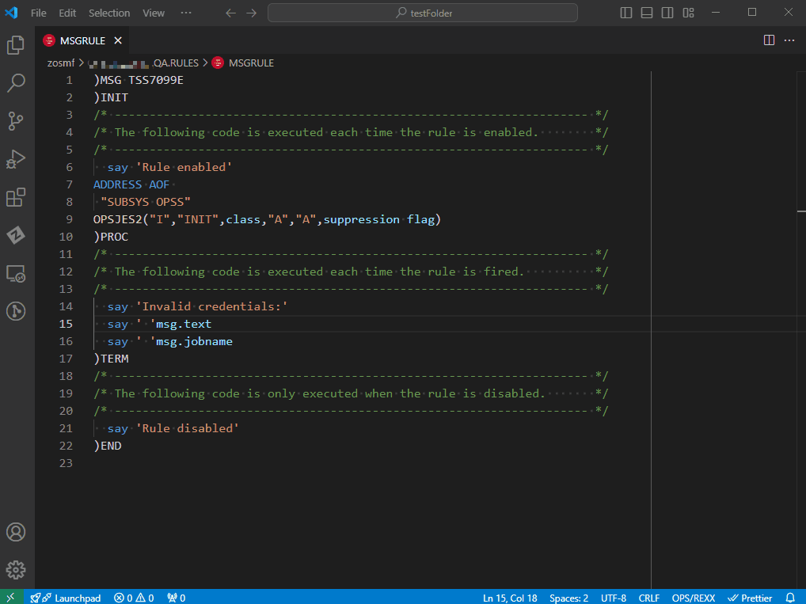
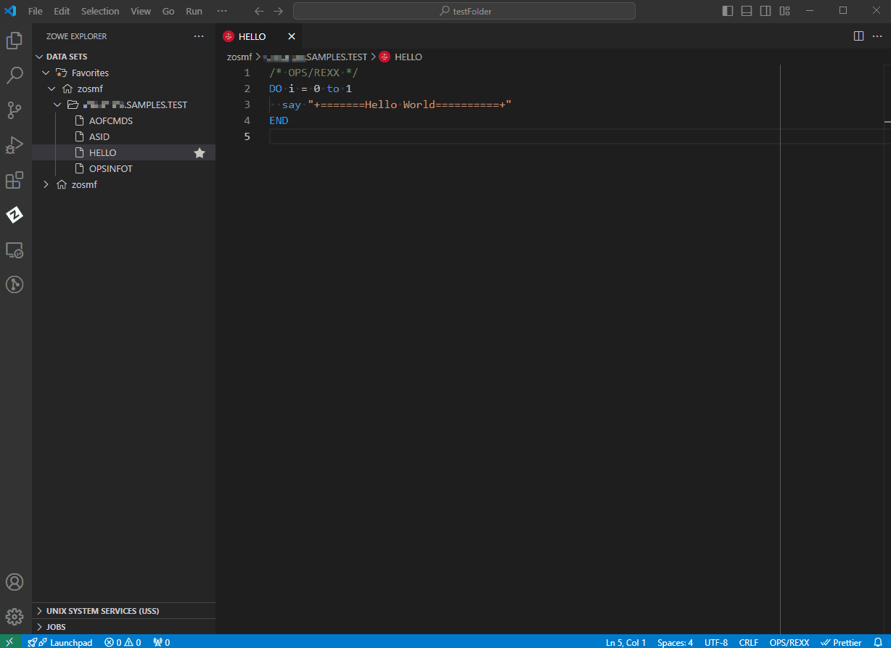
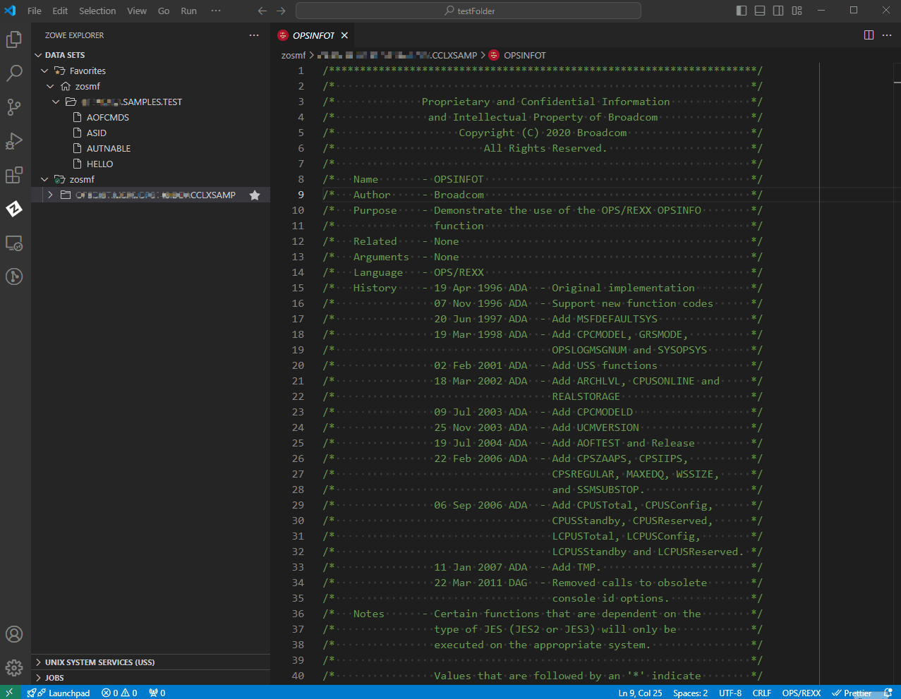
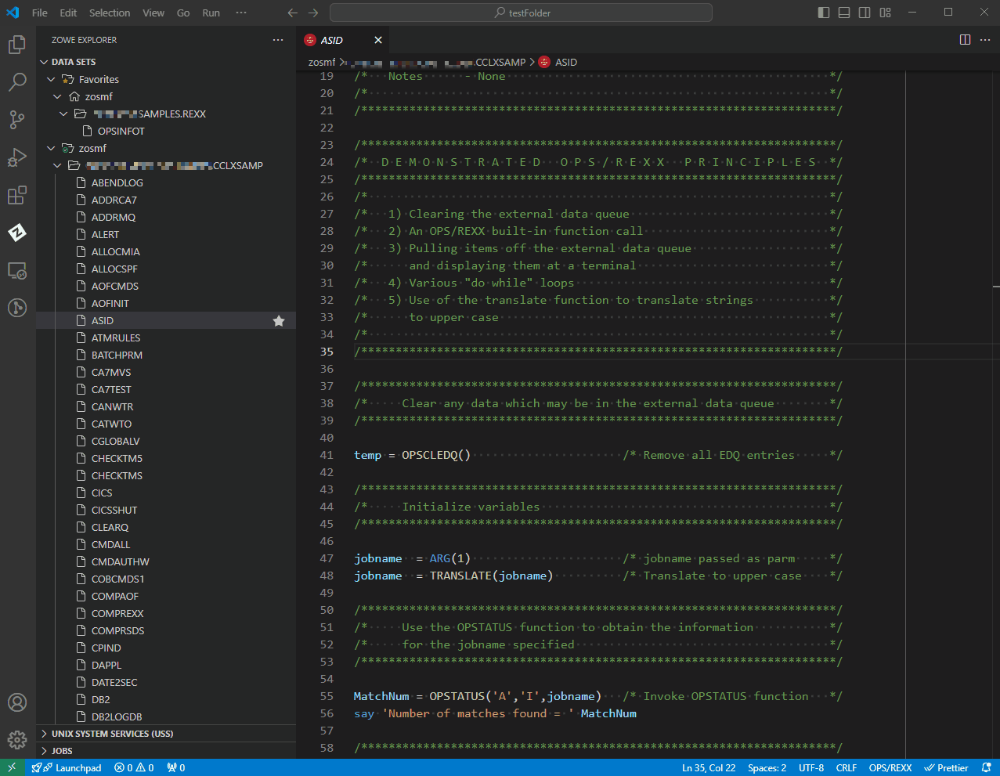
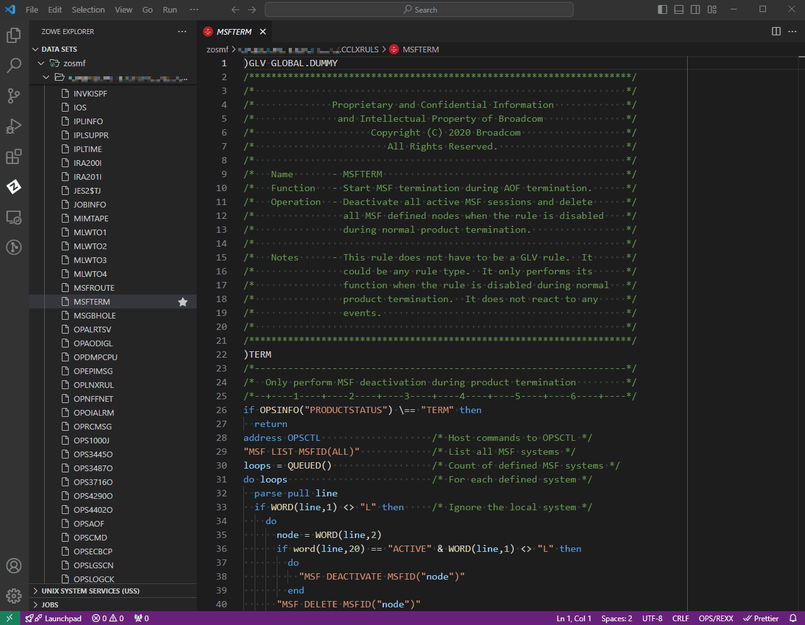

# OPS/REXX Language Support 

[](https://github.com/BroadcomMFD/opsrexx-language-support/issues)
[](/LICENSE)

The OPS/REXX language is a crucial part of the Broadcom OPS/MVS® product that adds to standard REXX a set of extensions to automate and enhance the productivity of z/OS operations. With the OPS/REXX Language Support extension, automation engineers can develop OPS/MVS Automated Operations Facility (AOF) rules and OPS/REXX programs more efficiently by editing OPS/REXX in a local VS Code environment.


## Key Features
OPS/REXX Language Support makes AOF rule and OPS/REXX program development easier by enabling you to

- Use OPS/REXX syntax highlighting to help distinguish the elements of AOF rules and OPS/REXX programs
- Use autocompletion for names of OPS/REXX built-in functions, host environments, and AOF event variables
- Get hover help on OPS/REXX built-in functions, host environment names, and AOF event variable names
- Get basic error checking for AOF rule and OPS/REXX syntax
- Copy from a library of frequently used OPS/REXX rule snippets
- Issue selected OPS/MVS commands to perform common rule actions and invoke OPS/REXX programs

The OPS/REXX Language Support extension does _not_ provide the ability for you to download from or upload to the mainframe. To access mainframe code while using OPS/REXX Language Support, we recommend Zowe Explorer (see [Recommended Software](#recommended-software)) or Zowe CLI.

## Recommended Software
The OPS/REXX Language Support extension has no prerequisite software. However, for your best experience with OPS/REXX Language Support, we recommend the following software.

### REXX Language Support Extension
For correct display of syntax highlighting, we recommend using OPS/REXX Language Support with a REXX language support extension. OPS/REXX Language Support has been tested for compatibility with the [Broadcom REXX Language Support extension](https://marketplace.visualstudio.com/items?itemName=broadcomMFD.lsp-for-rexx).

### Zowe Explorer
We recommend using Zowe Explorer to access mainframe code while using OPS/REXX Language Support. For more information about the Zowe Explorer extension, see [Zowe Explorer](https://marketplace.visualstudio.com/items?itemName=Zowe.vscode-extension-for-zowe) on the VS Code marketplace.


### OPS/MVS REST API
We recommend establishing a connection with your mainframe OPS/MVS instance using the [OPS/MVS REST API](https://techdocs.broadcom.com/us/en/ca-mainframe-software/automation/ca-ops-mvs-event-management-and-automation/14-0/using/use-the-rest-api.html). Using the REST API along with a Zowe Explorer profile containing connection information allows you to [issue OPS/MVS commands and invoke OPS/REXX programs](#issuing-opsmvs-commands) from within VS Code.

## Configuring OPS/REXX Language Support for OPS/MVS
Although it is possible to use OPS/REXX Language Support without access to OPS/MVS, most users will want to use the extension while interacting with an OPS/MVS instance. To configure OPS/REXX Language Support for use with OPS/MVS:

1. Ensure that your instance of OPS/MVS is configured with the OPS/MVS REST API (OPSREST) component.

2. In the OPS/REXX Language Support extension settings, set the `Subsystem` parameter to the default subsystem for the OPS/MVS instance you are using. If you want, you may also set default values for your program command parameters.

3. Create a team configuration file containing the connection information for the OPS/MVS instance you would like to connect to. Use _one_ of the following methods:

   - [Use Zowe Explorer](https://docs.zowe.org/stable/user-guide/ze-profiles) to create a team configuration file.  Provide the following information:
   
     - The host name of the LPAR on which the REST API is running.
     - The port number for the REST API.
     - A username that has authority to access the REST API.
     - The password to the account that is associated with the username.
    
   - Follow [these steps](https://techdocs.broadcom.com/us/en/ca-mainframe-software/devops/enterprise-support-for-zowe/1-0/zowe-cli/using-zowe-cli/available-cli-plug-ins/ca-ops-mvs-plug-in-for-zowe-cli.html#concept.dita_6781dd15fcd0eeb42754d0b2d929ef4b29d06c30_CreateAnOPSMVSProfile) to manually create a team configuration file.
    

4. When you are working with OPS/REXX files, ensure their file extension is `.opsrexx` to automatically enable OPS/REXX Language Support Extension features. For more information, see [Configuring OPS/REXX Language Support for Zowe Explorer](#configuring-opsrexx-language-support-for-zowe-explorer-recommended).

### Using OPS/REXX Language Support with multiple OPS/MVS instances
- If you are using the OPS/REXX Language Support extension with multiple OPS/MVS instances running on different systems, install and configure the OPS/MVS REST API on each system in your OPSplex. One instance of the REST API is required for each system.
- When you have multiple instances of OPS/MVS running on a single system, only one instance of the REST API is required.
   
## Configuring OPS/REXX Language Support for Zowe Explorer (Recommended)
To ensure that data sets accessed through Zowe Explorer are recognized by the extension as **.opsrexx** files, you must create a file association in your VS Code settings.

To create a file association, choose one of the following options.

**Option 1: Create a file association in Workspace Settings**     
1. Use the command palette in VS Code (**Ctrl/Cmd + Shift + P**) to locate the Workspace Settings.
2. Scroll down to the **Files: Associations** setting and click **Add Item**.
3. Add `*.REXX(*` to the **Key** field, and `opsrexx` to the **Value** field.
4. Add `*.RULES(*` to the **Key** field, and `opsrexx` to the **Value** field.

**Option 2: Create a file association in User Settings**
1. Use the command palette in VS Code (**Ctrl/Cmd + Shift + P**) to locate the file `settings.json` (User Settings).
2. In `settings.json`, add the lines `"*.REXX(*": "opsrexx"` and `"*.RULES(*": "opsrexx"` under `"files.associations"` as shown in the following example:
  
      ```
          "files.associations": {
              "*.REXX(*": "opsrexx",
              "*.RULES(*": "opsrexx",
          },
      ``` 

After completing the steps for either of these two options, you can use Zowe Explorer to access `.opsrexx` files.

## Using OPS/REXX Language Support

### OPS/REXX Syntax Highlighting
Use OPS/REXX syntax highlighting and symbol resolution to help you avoid syntax errors when developing rules.


### OPS/REXX Hover Insights
Place and hold your cursor over an OPS/REXX element to view more information about it. Hover insights are available for OPS/REXX built-in functions, host environments, or AOF event variable names.



### Variable Autocompletion
To trigger autocompletion of AOF variables, type `.` after an AOF rule type stem, for example: `msg.`

AOF variable completions are supported for all rule types.


Variable autocompletion is triggered automatically when you type an OPS/REXX built-in function or host environment name.


### Syntax Error Checking
OPS/REXX Language Support automatically performs some basic error checks on AOF rule and OPS/REXX program syntax, such as the line length warning shown in the following image.


### Using OPS/REXX Snippets
Using snippets promotes consistent and correct syntax in the rules you design. Before you write AOF rules from scratch, check the snippet library for any applicable rule snippets.

To use the snippet library:

1. Open the VS Code command palette by pressing `Ctrl/Cmd + Shift + P`.
2. Type `Insert Snippet`.
3. Click the command or press **Enter**.
4. Choose the type of rule snippet you want to insert.
5. Fill in the templated values to complete the OPS/REXX rule.


For a quicker way to access the snippets:

1. Begin typing the name of a snippet (such as `)MSG`) in the editor.
 
   VS Code autocomplete suggests the full name of the snippet.
 
2. Select the suggested snippet and press **Enter**.


### Issuing OPS/MVS Commands
To issue OPS/MVS commands from OPS/REXX Language Support, you need an OPS/MVS REST API connection. Configure the OPS/REXX Language Support extension for the connection as described in [Configuring OPS/REXX Language Support for OPS/MVS](#configuring-opsrexx-language-support-for-opsmvs).

You can use OPS/REXX Language Support to issue the following OPS/MVS commands:

  - `Show Rule Status` - Shows the status of a selected rule.   
  - `Enable Rule` - Enables a selected rule.
  - `Disable Rule` - Disables a selected rule.
  - `Execute Program` - Executes a selected OPS/REXX program using your default OPS/MVS subsystem.
  - `Execute Program with Parameters` - Executes an OPS/REXX program that you choose by typing parameters into an input form.

To issue OPS/MVS commands, use one of the following methods.

#### Option 1
1. In the Zowe Explorer sidebar of the VS Code application window, browse for and open the file containing the rule or program you want.
2. Type `Ctrl/Cmd + Shift + P` to open the VS Code command palette.
3. Select the command you want from the menu.  

**Tip:** The **OPS/MVS: Execute Program with Parameters** command can be used from the VS Code command palette regardless of which file is currently open.

#### Option 2
1. In the Zowe Explorer sidebar of the VS Code application window, right-click on the icon representing the rule or program you want.
2. From the pop-up menu, select the command you want.  

After a command is issued, the VS Code window displays a status message. If a command fails, a detailed error message displays.
 
See the following videos for examples of issuing commands.
 
**Show Rule Status (Option 1)**


**Enable Rule (Option 2)**


**Execute Program (Option 2)**


**Execute Program with Parameters (Key binding `Ctrl + Shift + E`)**


### Use Case Videos: Using OPS/MVS Automation Samples
You can use Zowe Explorer to copy OPS/MVS automation samples to your own library, then use the OPS/MVS Language Extension to develop and manage the samples. See the following videos for examples of this use case.

You can find a complete listing of the automation samples included with OPS/MVS [here](https://techdocs.broadcom.com/us/en/ca-mainframe-software/automation/ca-ops-mvs-event-management-and-automation/14-0/reference-information/sample-automation.html).

#### Copy and execute an OPS/MVS sample program


#### Copy an OPS/MVS sample program and execute it with parameters


#### Copy an OPS/MVS sample rule and enable it


 ------------------------------------------------------------------------------------------------
Copyright © 2024 Broadcom. The term "Broadcom" refers to Broadcom Inc. and/or its subsidiaries.
