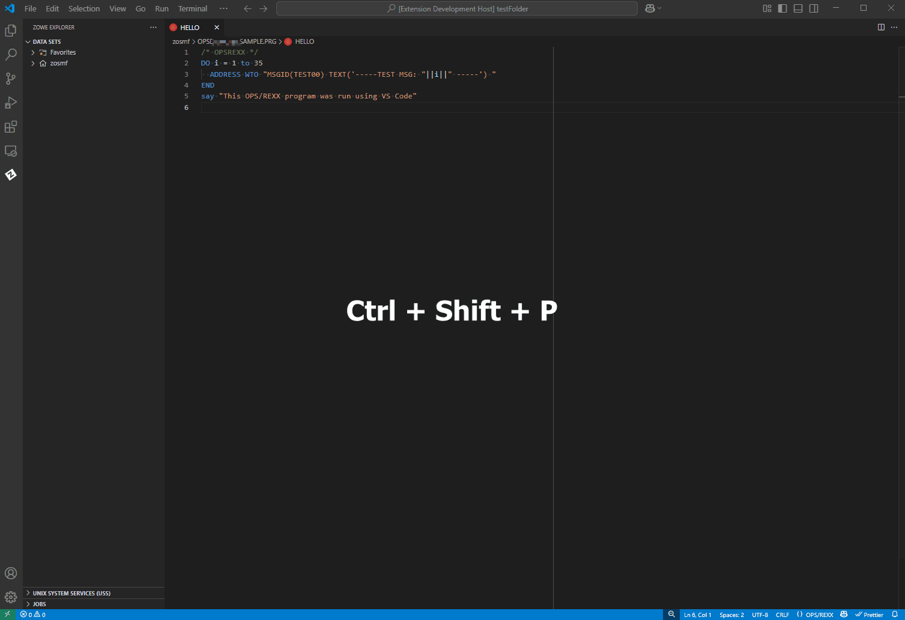

# OPS/REXX Language Support 

[](https://github.com/BroadcomMFD/opsrexx-language-support/issues)
[](https://marketplace.visualstudio.com/search?term=code4z&target=VSCode)


The OPS/REXX language is a crucial part of the Broadcom OPS/MVS® product that adds to standard REXX a set of extensions to automate and enhance the productivity of z/OS operations. With the OPS/REXX Language Support extension (OPS/REXX LS), automation engineers can develop OPS/MVS Automated Operations Facility (AOF) rules and OPS/REXX programs more efficiently by editing OPS/REXX in a local VS Code environment.

OPS/REXX LS includes the following features:

- OPS/REXX syntax highlighting
- Hover insights for OPS/REXX built-in functions, host environment names, and AOF event variable names
- Autocompletion for OPS/REXX built-in functions, host environment names, and AOF event variables
- Basic error checking for AOF rules and OPS/REXX syntax
- A library of frequently used OPS/REXX rule snippets
- If configured, specific OPS/MVS commands can be run to perform common rule actions, search OPSLOG records, and execute OPS/REXX programs

We encourage you to share ideas to help improve OPS/REXX Language Support. You can also report issues in the extension, using the following link.

> [Share an idea or open an issue in our Git repository](https://github.com/BroadcomMFD/opsrexx-language-support/issues)


OPS/REXX LS is part of the [Code4z](https://techdocs.broadcom.com/code4z) experience from Broadcom, which offers a modern experience for mainframe application developers. To get started with Code4z, check out our foundational [extension pack](https://marketplace.visualstudio.com/items?itemName=broadcomMFD.code4z-extension-pack).

<br />
<br />

<details>
<summary><span style="font-size: 1.5em"><b>Address Software Requirements</b></span><hr></summary>

OPS/REXX LS has no prerequisite software. Use the following recommended software with OPS/REXX LS for the best experience:
- REXX Language Support Extension
- OPS/MVS REST API
- Zowe Explorer

<details><summary><span style="font-size: 1.3em">REXX Language Support Extension</span></summary>

For correct display of full REXX syntax highlighting, use a REXX language support extension. OPS/REXX LS has been tested for compatibility with the [REXX Language Support extension](https://marketplace.visualstudio.com/items?itemName=broadcomMFD.lsp-for-rexx).

</details>

<details>
<summary><span style="font-size: 1.3em">OPS/MVS REST API</span></summary>

Establish a connection with your mainframe OPS/MVS instance using the OPS/MVS REST API as described in the [OPS/MVS documentation](https://techdocs.broadcom.com/us/en/ca-mainframe-software/automation/ca-ops-mvs-event-management-and-automation/14-0/using/use-the-rest-api.html). A connection to one or more OPS/MVS instances allows you to work with the AOF rules in your mainframe environment and to issue OPS/MVS commands from VS Code. Connecting to OPS/MVS through the REST API enables you to access all the OPS/MVS features available through the OPS/REXX LS extension. 

</details>

<details>
<summary><span style="font-size: 1.3em">Zowe Explorer</span></summary>


Use Zowe Explorer to access mainframe code while using OPS/REXX LS. For more information about the Zowe Explorer extension, see [Zowe Explorer](https://marketplace.visualstudio.com/items?itemName=Zowe.vscode-extension-for-zowe) on the VS Code marketplace.


</details>

<details><summary><span style="font-size: 1.3em">Security Requirements</span></summary>

The connection from OPS/REXX LS to OPS/MVS must be secured using one or both of the following methods. 

 **OPS/MVS REST API**  
This method requires a Zowe profile containing connection information for the REST API server.  This connection type is recommended for enterprise-level use of OPS/REXX LS. For more information, see "Configure OPS/REXX LS to Access OPS/MVS Using the OPS/MVS REST API."

 **SSH**  
Connecting to OPS/MVS using the SSH Protocol is recommended for situations where quick setup is important, such as individual experimentation. It gives you access to a subset of the OPS/MVS features available through OPS/REXX LS. The SSH connection method has the following prerequisites:

  - A Zowe SSH profile containing the host name, username and password for an SSH connection.  
   
  - A destination data set in which to store the REXX program `OPSVSCE`, which enables the OPS/REXX LS connection to SSH. For more information, see "Configure OPS/REXX LS to Access OPS/MVS Using SSH." 
    
  - The OX load module, which is provided by OPS/MVS in the load library `CCLXLOAD`, must be in one of the following locations:  
    
    - In a PDS or PDSE included in `LNKLST` or `LPALIB`
      
    - In a STEPLIB. If OX is located in a STEPLIB, an `.ops_profile` data set for each user of OPS/REXX LS must specify the location of the STEPLIB.    

For more information about the OX load module, see [Provide APF Authorization for the Load Libraries](https://techdocs.broadcom.com/us/en/ca-mainframe-software/automation/ca-ops-mvs-event-management-and-automation/14-0/installing/complete-configuration-tasks/complete-the-required-manual-configuration-tasks/provide-apf-authorization-for-the-load-libraries.html) in the OPS/MVS documentation.  

For more information about these requirements, see "Configure OPS/REXX LS to Access OPS/MVS Using SSH." 

</details>

</details>

<details><summary><span style="font-size: 1.5em"><b>Getting Started</b></span><hr></summary>

<details><summary><span style="font-size: 1.3em">Customize Extension Settings</span></summary>
  
> **Note:**
> Most extension settings are not discussed here. If an extension setting is not mentioned here, you can set it to reflect your site's preferences.

**Select Connection Type**

Customize OPS/REXX LS settings in VS Code for the type of secure connection to OPS/MVS that you will use. 

1. From the **File** menu, select **Preferences > Settings** to display the **Settings** editor, then use the search bar to search for `OPS/REXX`.

2. Select the **User** or **Workspace** tab, depending on the level of settings you want to update.

3. For the **Connection Mode** setting, select one of the following options to determine which secure connection type OPS/REXX LS uses when it issues commands to OPS/MVS.

   - **ADAPTIVE** (default): OPS/REXX LS automatically uses the type of connection that is supported by each command. If the command supports both types of connection, the extension uses the **Preferred Connection Order** setting to determine which secure connection type to use.
     
   - **ONLY_REST-API**: OPS/REXX LS uses only the REST API connection to interact with OPS/MVS. Commands requiring SSH will fail.
  
   - **ONLY_SSH**: OPS/REXX LS uses only SSH to interact with OPS/MVS. Commands requiring a REST API connection will fail.

4. If you selected **ADAPTIVE** as the **Connection Mode**, specify the **Preferred Connection Order**.

    - **REST-API then SSH**  
      The extension tries to connect to OPS/MVS using a REST API connection first, then uses SSH if a REST API connection is not available.

    - **SSH then REST-API**  
      The extension tries to connect to OPS/MVS using an SSH connection first, then uses the REST API if SSH is not available.  
            
**Create File Associations for Zowe Explorer**   

To ensure that all OPS/REXX programs and rules are recognized by OPS/REXX LS as `.opsrexx` files, create a file association in your VS Code settings to associate data sets that contain OPS/REXX rules with the `.opsrexx` file extension.

To create a file association for a data set:

1. From the **File** menu, select **Preferences > Settings** to display the Settings editor.

2. Select the **User** or **Workspace** tab, depending on which settings you want to update.

3. Scroll down to or search for the **Files: Associations** setting and select **Add Item**.

4. Add `**/*QUALIFIER*{,/*}` to the **Key** field and `opsrexx` to the **Value** field where `QUALIFIER` is the portion of the fully qualified data set path you want to be automatically set as an OPS/REXX file type.

    **Example:** if you have a fully qualified data set named `OPSS.CCLXSAMP.SAMPLE.RULES`, you could put `**/*RULES*{,/*}` or `**/*CCLXSAMP*{,/*}` in the **Key** field to automatically associate all files in any data set with the matching qualifier.

After completing these steps, you can use Zowe Explorer to access OPS/REXX files in data set members and use all the features of OPS/REXX LS.

<!-- TPR comment: Needs verification step. Actual procedure is a good Walkthrough candidate. Actually describing steps to associate a data set and its members as opsrexx files -->
 
</details>

<details><summary><span style="font-size: 1.3em">Configure OPS/REXX LS to Access OPS/MVS Using the REST API</span></summary>

Connecting to OPS/MVS through the OPS/MVS REST API gives you access to all of the OPS/MVS features offered by OPS/REXX LS. 
 
To set up a connection through the REST API:

1. Ensure that OPS/MVS is configured with the OPS/MVS REST API (OPSREST) component.
   
   If you are using OPS/REXX LS with multiple OPS/MVS instances running on different systems, the OPS/MVS REST API must be installed and configured on each system in your OPSplex. One instance of the REST API is required for each system. When you have multiple instances of OPS/MVS running on a single system, only one instance of the REST API is required.

2. Create a team configuration file that contains the connection information for the OPS/MVS instance. Use _one_ of the following methods:

   - [Use Zowe Explorer](https://docs.zowe.org/stable/user-guide/ze-profiles) to create a team configuration file using the following information:
     - The host name of the LPAR on which the REST API is running.
     - The port number for the REST API.
     - A username that has authority to access the REST API.
     - The password to the account that is associated with the username.
    - [Manually create a team configuration file](https://techdocs.broadcom.com/us/en/ca-mainframe-software/automation/ca-ops-mvs-event-management-and-automation/14-0/installing/complete-configuration-tasks/configure-the-rest-api/integrate-with-zowe-cli.html#:~:text=Verify%20the%20Configuration.-,Update%20Team%20Configuration%20Manually,-Create%20a%20plug) as described in the OPS/MVS documentation. This method also requires a host name, port number, username, and password (see previous bullet for details).
  
<!-- TPR comment: Needs a verification step -->

</details>

<details>
<summary><span style="font-size: 1.3em">Configure OPS/REXX LS for Single Sign-on (SSO) to the OPS/MVS REST API</span></summary>

Integrating OPS/REXX LS with Zowe API Mediation Layer (API ML) allows you to authenticate your connection to the OPS/MVS REST API using SSO. To integrate OPS/REXX LS with Zowe API ML, follow the instructions in the section "Configure OPS/REXX LS to Access OPS/MVS Using the REST API," with the following adjustments:

1. Edit the team configuration file to use the following information in the `base` profile:
     - The host name for Zowe API ML instance that you want to access.
     - The port number for Zowe API ML instance that you want to access.

2. To enable access to OPS/MVS commands from OPS/REXX LS using SSO, edit the `ops` profile in the Zowe team configuration file to include:  
   -  the base path to the OPS/MVS REST API registered to the API ML instance specified in your `base` profile.
   -  a `rest-api` parameter with a value of `true`

An example of an edited `ops` profile is shown here:  
  
``` json  
    "OPSREST": {
            "type": "ops",
            "properties": {
                "basePath": "opsrest/api/v1",
                "rest-api": true,
            }
        },
```
3. To enable login to API ML using Zowe Explorer and access to z/OS data sets using SSO, edit the `zosmf` profile in the Zowe team configuration file to include only the base path to the z/OSMF API registered to the API ML instance specified in your `base` profile.

An example of an edited `zosmf` profile is shown here:

``` json
      "zosmf": {
         "type": "zosmf",
         "properties": {
              "basePath": "ibmzosmf/api/v1"
          }
      },
```

> **Note:**
> The `zosmf` and `ops` profiles use the host and port for Zowe API ML from the `base` profile. Ensure that you do not provide username, password, host, or port directly on the `ops` or `zosmf` profiles. Supplying those options causes Zowe to ignore the API ML token in your base profile and access the service directly. For information on how profiles work together in a Zowe team configuration file, see [Using Base Profiles and Tokens with Existing Profiles](https://docs.zowe.org/stable/user-guide/ze-profiles/#using-base-profiles-and-tokens-with-existing-profiles).

4.  In the Zowe Explorer tree view pane, right click on **zosmf** to display a context menu.

5.  Select **Manage Profile**.  
    VS Code displays a Quick Pick menu of profile actions.  

6.  Select **Log in to Authentication Service** to log in to Zowe API ML using the API ML information in your team configuration file.
 
    After the initial login:
    -  Your team configuration profile is updated:
        - The `base` profile is updated to include `tokenType` and `tokenValue` parameters for the API ML as in the following example:

         ``` json
        "base": {
            "type": "base",
            "properties": {
                "host": "example.com",
                "port": 12345,
                "tokenType": "apimlAuthenticationToken"
            },
            "secure": [
                "tokenValue",
            ]
        },
        ```

        - The `zosmf` profile is updated to include an `authOrder` parameter with the value `token, bearer`.

    - Future commands using the OPS/MVS REST API server or z/OSMF will be made through Zowe API ML, using the `tokenValue` stored in the `base` profile until the token's expiration.
    - Once the token is expired, use steps 4-6 to re-authenticate to API ML.
    - A token can be invalidated at any time by following steps 4 and 5, then choosing **Log out from Authentication Service** from the Quick Pick menu.
</details>

<details><summary><span style="font-size: 1.3em">Configure OPS/REXX LS to Access OPS/MVS Using SSH</span></summary>

As an alternative to connecting to OPS/MVS using the OPS/MVS REST API, you may access a subset of OPS/REXX LS features by connecting to OPS/MVS subsystems using Secure Shell Protocol (SSH). This type of connection is recommended for individual testing of the extension, since it enables quick setup.

To establish a connection to OPS/MVS using SSH:

1. Specify the location of the OX load module.
    
    _If_ the OPS/MVS OX load module (see "Address Security Requirements") is not deployed to a LNKLST or LPALIB library, update the `.ops_profile` for each user of OPS/REXX LS to specify the library that contains the load module as a STEPLIB export, as shown in the following example:
    
   `#!/_bin_/_sh_  _load module_`     
   `# this shell script allows the shell to invoke`    
   `# OX which resides in the OPS/MVS loadlib.`    
   `export STEPLIB="SYS1.OPS.CCLXLOAD"`  
 
  > **Note:**
  > Ensure that `.ops_profile` contains no echo statements.
   
2.  Create an OPSVSCE SSH connection profile.       
    
    > **Note:**
    > If you do not create an SSH profile during setup, and you attempt to issue a command using an SSH connection, you will be prompted to create a profile.

    1. Use the VS Code Command Palette to issue the command **OPS/MVS: Manage OPS/REXX LS SSH Connection Profiles**.  
       The command displays a list of settings to allow you to create a profile.

    2. Specify values for the following settings using the VS Code UI: 

       **Profile Name** (Required)  
       Enter a name for the OPSVSCE SSH profile. The name must match an existing Zowe SSH profile, which allows your OPSVSCE SSH profile to use the host name, username and password included in the Zowe profile to make the connection to OPS/MVS. If the name you enter does not match a Zowe SSH profile, you will be prompted to change it.  

       **Backend Data Set** (Required)   
       Enter a name for a data set in which to store the REXX program `OPSVSCE`, which enables OPS/REXX LS to carry out OPS/MVS commands over SSH.  

       **Default Subsystem** (Optional)      
       Specify the default OPS/MVS subsystem to be used for requests made with this profile. Defaults to OPSS.

       **Install z/OS Unix path** (Optional)    
       Specify the z/OS Unix path where the SSH manager creates the directory `.opsrexx-vsce`.     

       If a path is not specified, your home directory is used. This directory is used to run the commands that are needed to prepare `OPSVSCE` and deploy it to the specified  **Backend Data Set**. The directory is only used to transfer files to the backend data set, after which it is automatically emptied. 

    3.  Select **Add this OPS/REXX LS SSH Profile to your settings**.  
        The OPSVSCE SSH profile is saved to your OPS/REXX LS settings. 

3. Use the VS Code Command Palette to issue the command **OPS/MVS: Deploy Backend**.  
   A menu appears.

4. From the menu, select the system where you will deploy the `OPSVSCE` program.  (Refer to the description of **Backend Data Set** in the previous step.)    
   When you select a system, OPS/REXX LS checks for an appropriate OPSVSCE SSH profile and deploys `OPSVSCE` to the data set you specified.

The SSH connection to OPS/MVS is established. 

> **Note:**
> We recommend that you use the **OPS/MVS: Manage OPS/REXX LS SSH Connection Profiles** command and the VS Code UI to create or edit OPSVSCE SSH profiles. 
However, you may create a profile or edit it directly in `settings.json`.  To do this, in your OPS/REXX LS settings under **SSH Connection Profiles**, click the link **Edit in settings.json**.

   The SSH profile settings as they appear in the JSON file are listed here:

   **name** (Required)  
  The name of the profile, which must match a Zowe SSH profile name.

   **deployDataset** (Required)  
  The name of the data set in which to store `OPSVSCE`.

   **defaultSubsystem** (Optional)  
  The default OPS/MVS subsystem to be used for requests made with this profile. Defaults to OPSS.

   **installUssPath** (Optional)  
  The z/OS Unix path where the SSH manager will create a directory called `.opsrexx-vsce`. 

</details>

</details>


<details><summary><span style="font-size: 1.5em"><b>Review Basic Functions</b></span><hr></summary>

OPS/REXX programs and rules are automatically recognized when opened in VS Code in the following cases:
- When the file extension is `.opsrexx`
- When the first line of the file contains either the comment `/* OPSREXX */` or a rule type identifier, such as `)CMD` or `)MSG` (case-insensitive)
- When data set members that contain OPS/REXX programs and rules are opened using Zowe Explorer and the containing data set is associated with `opsrexx` files

When OPS/REXX programs and rules are recognized, syntax highlighting and basic error checking on AOF rules and OPS/REXX program syntax is enabled by default. Additional features of OPS/REXX LS are available depending on context and your configuration.

<details>
<summary><span style="font-size: 1.3em">OPS/REXX Hover Insights</span></summary>

Place and hold your cursor over an OPS/REXX element to view more information about it. Hover insights are available for OPS/REXX built-in functions, host environments, or AOF event variable names.


</details>

<details><summary><span style="font-size: 1.3em">Autocompletion</span></summary>

Autocompletion works for the following OPS/REXX language elements:
- AOF variables
- Built-in functions
- Host environment names

To trigger autocompletion of AOF variables, enter `.` after an AOF rule type stem, for example: `msg.` AOF variable completions are supported for all rule types.

Built-in function autocompletion is triggered automatically when you type an OPS/REXX built-in function or host environment name.


</details>

</details>

<details><summary><span style="font-size: 1.5em"><b>Review Scenarios</b></span><hr></summary>
  
<details><summary><span style="font-size: 1.3em">Build AOF Rules with OPS/REXX Snippets</span></summary>

Before you write AOF rules from scratch, check the snippet library for any applicable rule snippets. Using snippets promotes consistent and correct syntax in the rules you design. 

To use the snippet library:

1. Press `Ctrl/Cmd+Shift+P` to open the VS Code Command Palette.
2. Type `Insert Snippet`.
3. Select the command or press **Enter**.
4. Choose the type of rule snippet you want to insert.
5. Fill in the templated values to complete the OPS/REXX rule.

If you know the name of the snippet you want to use, you can begin typing the name of the snippet in the editor and select from the list of suggestions.


</details>

<details><summary><span style="font-size: 1.3em">Issue OPS/MVS Commands</span></summary>

Issuing OPS/MVS commands from OPS/REXX LS requires connecting securely to an OPS/MVS subsystem using the OPS/MVS REST API or using SSH.   

  - Certain commands require an OPS/MVS REST API connection.
  - The only commands that require an SSH connection are those related to setting up the SSH connection.

Use OPS/REXX LS to issue the following OPS/MVS commands by connecting through the OPS/MVS REST API or by connecting with SSH:

  - `Show Rule Status` - Shows the status of a selected rule.   
  - `Enable Rule` - Enables a selected rule.
  - `Disable Rule` - Disables a selected rule.
  - `Set Auto Enable` - Turns on the auto-enable feature for a selected rule.
  - `Reset Auto Enable` - Resets the auto-enable feature for a selected rule. 
  - `Rule Facility` - Allows you to check and modify the following rule statuses: active or inactive, auto-enabled or not auto-enabled.

The following OPS/MVS commands are available when you use an OPS/MVS REST API connection:

  - `Execute Program` - Executes an OPS/REXX program that you choose by typing parameters into an input form.
  - `Search OPSLOG Records` - Provides a table of OPSLOG records that match your specified search parameters.

 To issue OPS/MVS commands using Zowe Explorer:
  1.  In the Zowe Explorer sidebar, locate the data set containing the rule or program you want to work with.
  2.  Right-click the data set member you want. An OPS/REXX LS menu appears.
  3.  Select the command you want from the OPS/REXX LS menu.  
After a command is issued, the VS Code window displays a status message. If a command fails, a detailed error message displays.

The following video demonstrates how to issue an OPS/MVS command using Zowe Explorer:


</details>

<details>
<summary><span style="font-size: 1.3em">Execute OPS/REXX Programs</span></summary>

If you are using Zowe Explorer, issue the `Execute Program` command as described in "Issue OPS/MVS Commands." When you select **Execute Program** from the right-click menu, you are taken to the VS Code Command Palette, where you can enter any arguments that must be passed to the program.

You can also issue commands by using the VS Code Command Palette (`Ctrl+Shift+P`):


> **Tip**  
> You can use the keyboard shortcut `Ctrl+Shift+E` to specify the **OPS/MVS: Execute Program** command in the VS Code Command Palette. If the program you want to run is currently open, the command UI populates the name of the program.

</details>

<details>
<summary><span style="font-size: 1.3em">Search OPSLOG Records</span></summary>

Use the **OPS/MVS: Search OPSLOG Records** command to search the live OPS/MVS OPSLOG.

If you select **Submit Search** without specifying parameters, you can browse the most recent records or the oldest records from the OPSLOG:


Specify parameters to search for specific text in the OPSLOG:



> **Tip**  
> To select a different OPSLOG to search, select **OPS/MVS: Search OPSLOG Records > Search Settings > Log Name**.

</details>

<details><summary><span style="font-size: 1.3em">Use OPS/MVS Automation Samples</span></summary>
OPS/MVS distributes sample AOF rules, OPS/REXX programs, and user exits that demonstrate various aspects of automating operations in a mainframe environment. You can use Zowe Explorer to copy these samples to your own library, and use OPS/REXX LS to develop, manage, and run your versions of these samples.


For a complete listing of the automation samples that are included with OPS/MVS, see [Sample Automation](https://techdocs.broadcom.com/us/en/ca-mainframe-software/automation/ca-ops-mvs-event-management-and-automation/14-0/reference-information/sample-automation.html) in the OPS/MVS documentation.

</details>

</details>


</details>

<details>
<summary><span style="font-size: 1.5em"><b>Zowe Conformance Program</b></span><hr></summary>


OPS/REXX LS is Zowe Explorer V3 Conformant. The Zowe Conformance Program ensures a high level of common functionality, interoperability, and user experience while using an extension that leverages Zowe. For more information, see [Zowe Conformance Program](https://www.openmainframeproject.org/all-projects/zowe/conformance).

</details>

<details>
<summary id="technical-assistance-and-support"><span style="font-size: 1.5em"><b>Technical Assistance and Support</b></span><hr></summary>
OPS/REXX Language Support is made available to customers on the Visual Studio Code Marketplace in accordance with the terms and conditions contained in the provided End-User License Agreement (EULA).

If you are on active support for OPS/MVS, you get technical assistance and support in accordance with the terms, guidelines, details, and parameters that are located within the Broadcom [Working with Support](https://support.broadcom.com/external/content/release-announcements/CA-Support-Policies/6933) guide.

This support generally includes:

- Telephone and online access to technical support
- Ability to submit new incidents 24x7x365
- 24x7x365 continuous support for Severity 1 incidents
- 24x7x365 access to Broadcom Support
- Interactive remote diagnostic support
- Technical support cases must be submitted to Broadcom in accordance with guidance provided in “Working with Support”.

> **Note**  
> To receive technical assistance and support, you must remain compliant with “Working with Support”, be current on all applicable licensing and maintenance requirements, and maintain an environment in which all computer hardware, operating systems, and third party software associated with the affected Broadcom software are on the releases and version levels from the manufacturer that Broadcom designates as compatible with the software. Changes you elect to make to your operating environment could detrimentally affect the performance of Broadcom software and Broadcom shall not be responsible for these effects or any resulting degradation in performance of the Broadcom software. Severity 1 cases must be opened via telephone and elevations of lower severity incidents to Severity 1 status must be requested via telephone.

</details>

<details>
<summary id="privacy-notice"><span style="font-size: 1.5em"><b>Privacy Notice</b></span><hr></summary>
The extensions for Visual Studio Code developed by Broadcom Inc., including its corporate affiliates and subsidiaries, ("Broadcom") are provided free of charge, but in order to better understand and meet its users’ needs, Broadcom may collect, use, analyze and retain anonymous users’ metadata and interaction data, (collectively, “Usage Data”) and aggregate such Usage Data with similar Usage Data of other Broadcom customers. Please find more detailed information in License and Service Terms & Repository.

</details>


Copyright © 2026 Broadcom. The term "Broadcom" refers to Broadcom Inc. and/or its subsidiaries.
